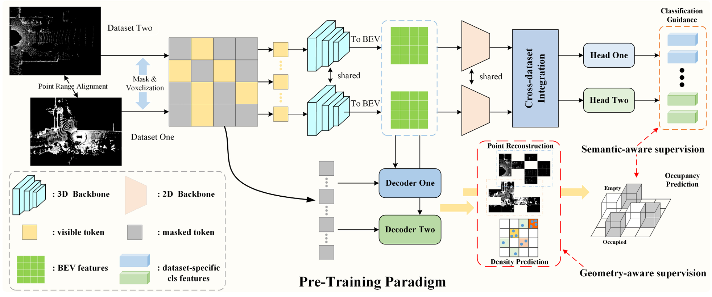
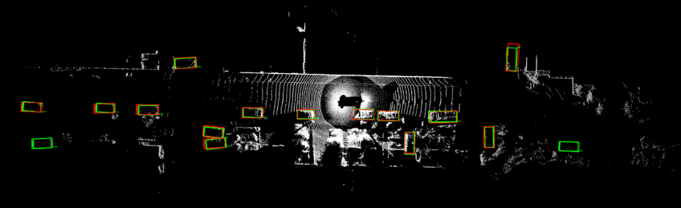
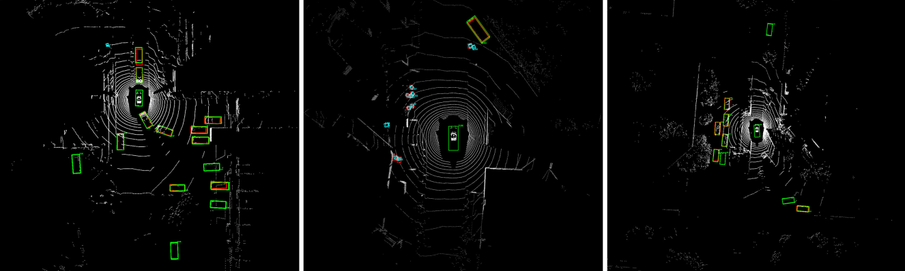
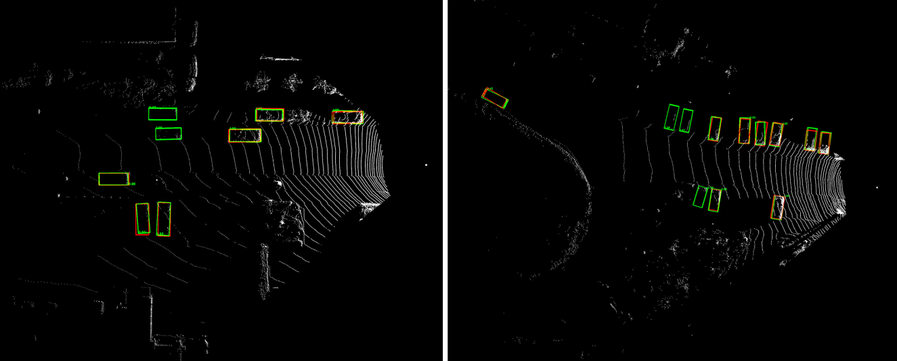

# UniPT: A Unified Representation Pre-Training for Multi-dataset 3D Object Detection
This is an official implementation of UniPT-a pre-training method to learn unified representation for Multi-dataset 3D Object Detection.

## Framework
<p align="center">  </p>
Current multi-dataset 3D object detection pipelines directly train the detectors from scratch, which achieves suboptimal performance owing to intrinsic discrepancies between various scenarios. In this paper, we observe that there are underlying shared spatial and semantic characteristics that can be excavated in a self-supervised and fully-supervised manner. Motivated by this, we propose a novel pre-training method (UniPT) with geometry-aware and semantic-aware supervision to obtain a universal representation of multiple datasets, thus reducing the vast differences. Concretely, we firstly perform the reconstruction of point cloud and point density estimation. Then, the occupancy prediction and classification guidance are provided in semantic-aware supervision. Moreover, we devise a cross-dataset integration scheme to minimize the differences of dataset-level features between domains. Extensive experiments on Waymo Open Dataset (WOD), nuScenes and KITTI with consolidation settings illustrate the effectiveness of our method. It is notable that UniPT surpasses the previous work Uni3D by 2.29 mAPH (L1) on WOD, 1.45 mAP (BEV) on nuScenes and 2.08 mAP (3D) on KITTI.

## Getting Started
You may refer to [INSTALL.md](docs/INSTALL.md) for the installation of `UniPT` and [GETTING STARTED.md](docs/GETTING_STARTED.md) to prepare the datasets.

## Training-Testing for UniPT on Multi-dataset Object Detection

Here, we take Waymo-nuScenes consolidation as an example.

## Pre-training stage: train a UniPT model on the merged dataset: 

```shell script
bash scripts/MDF/dist_train_unipt.sh ${NUM_GPUs} \
--cfg_file ./cfgs/MDF/waymo_nusc/unipt_voxel_rcnn_waymo_nusc.yaml \
--source_one_name waymo
```

* Pre-train other networks such as PV-RCNN using multiple GPUs
```shell script
bash scripts/MDF/dist_train_unipt.sh ${NUM_GPUs} \
--cfg_file ./cfgs/MDF/waymo_nusc/unipt_pv_rcnn_waymo_nusc.yaml \
--source_one_name waymo
```

## Fine-tuning stage: train baseline detection models using above pre-trained networks on the merged dataset: 

```shell script
bash scripts/MDF/dist_train_mdf.sh ${NUM_GPUs} \
--cfg_file ./cfgs/MDF/waymo_nusc/waymo_nusc_voxel_rcnn_feat_3_FT.yaml \
--pretrained_model {The path of your pre-trained checkpoint} \
--source_one_name waymo
```

* Fine-tune other detection models such as PV-RCNN using multiple GPUs
```shell script
bash scripts/MDF/dist_train_mdf.sh ${NUM_GPUs} \
--cfg_file ./cfgs/MDF/waymo_nusc/waymo_nusc_pv_rcnn_feat_3_FT.yaml \
--pretrained_model {The path of your pre-trained checkpoint} \
--source_one_name waymo
```

&ensp;
## Evaluation stage: evaluate the detection model on different datasets:
* Note that for the KITTI-related evaluation, please try --set DATA_CONFIG.FOV_POINTS_ONLY True to enable front view point cloud only.

- ${FIRST_DB_NAME} denotes that the first dataset name of the merged two dataset, which is used to split the merged dataset into two individual datasets.

- ${DB_SOURCE} denotes the dataset to be tested.

* Test the models using multiple GPUs
```shell script
bash scripts/MDF/dist_test_mdf.sh ${NUM_GPUs} --cfg_file ${CFG_FILE} --ckpt ${CKPT} \
--source_one_name ${FIRST_DB_NAME} --source_1 ${DB_SOURCE} 
```

## Visualization
<p align="center">  </p>

<p align="center">  </p>

<p align="center">  </p>
